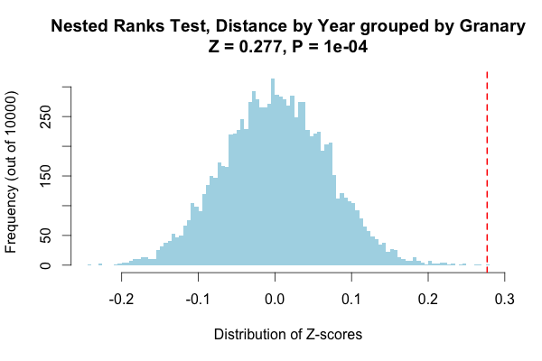

nestedRanksTest
===============

Tne `nestedRanksTest` package provides functions for performing a
Mann-Whitney-Wilcoxon-type nonparametric test for a difference between
treatment levels using nested ranks, and also provides functions for displaying
results of the test.  The nested ranks test may be used when observations are
structured into several groups and each group has received both treatment
levels.  The p-value is determined via bootstrapping.

The `nestedRanksTest` is intended to be a mixed-model extension of the
[`wilcox.test`][wilcox], for which treatment is a fixed effect and group
membership is a random effect.

[wilcox]: https://stat.ethz.ch/R-manual/R-patched/library/stats/html/wilcox.test.html

The development version is hosted here and can be installed via:

```R
install.packages("devtools")
devtools::install_github("douglasgscofield/nestedRanksTest")
library(nestedRanksTest)
```

Help is available via `help("nestedRanksTest")`.

* * *
These statistical tools were developed in collaboration with Peter E.
Smouse (Rutgers University) and Victoria L. Sork (UCLA) and were funded by
U.S. National Science Foundation awards NSF-DEB-0514956 and
NSF-DEB-0516529.
* * *


To Use It
---------

The principle function is `nestedRanksTest()`, with two interfaces.  The
formula interface is perhaps the simplest to use. It allows specification of 
quantitative measures, treatments and group membership using R's familiar
formula syntax.  Treat group membership as a random factor or
grouping variable by using `"|"`;

```R
data(woodpecker_multiyear)
result <- nestedRanksTest(Distance ~ Year | Granary, data = woodpecker_multiyear,
                          subset = Species == "agrifolia")
print(result)
```

~~~~

	Nested Ranks Test

data:  Distance by Year grouped by Granary
Z = 0.277, p-value = 1e-04
alternative hypothesis: Z lies above bootstrapped null values
null values:
      0%       1%       5%      10%      25%      50%      75%      90%      95%      99%     100% 
-0.29492 -0.15583 -0.11059 -0.08705 -0.04554 -0.00124  0.04430  0.08488  0.10936  0.15335  0.27695 

bootstrap iterations = 10000 
group weights:
        10         31        140        151        152        938        942 
0.05204461 0.04646840 0.02478315 0.14560099 0.30359356 0.29120198 0.13630731 
~~~~

```R
plot(result)
```



The default interface uses arguments for specifying the variables.

```R
result <- nestedRanksTest(Year, Distance, Granary, ...)
```

Details
-------

The statistic for the nested ranks test is a Z-score calculated by comparing
ranks between treatment levels, with contributions of each group to the final
Z-score weighted by group size.  The p-value is determined by comparing the
observed Z-score against a distribution of Z-scores calculated by bootstrapping
ranks assuming no influence of treatment while respecting group sizes. When
there is just one group, this test is essentially identical to a standard
Mann-Whitney-Wilcoxon test.

We first described this test in [Thompson _et al._ 2014 _Movement Ecology_
2:12](http://www.movementecologyjournal.com/content/2/1/12).   We examined
year-to-year differences in acorn movement by acorn woodpeckers in an oak
savannah in central California.  Acorn woodpeckers are highly social, and each
social group maintains its own granary in which it stores acorns.  The
woodpeckers are highly territorial and occupy relatively stable territories,
each containing a number of mature oak trees at varying distances from the
granary.  Because each granary has its own neighbourhood of oak trees, it would
not be a very precise test to look for overall differences in acorn movement
within the entire savannah, on the other hand looking for differences within
each granary individually would have required greater than practical sample
sizes to have sufficient statistical power.  We chose instead to test whether
the distance ranks differ between years within each granary, and combine
results across granaries for an aggregate between-year test.

Note: The generation of a null distribution can take some time.  For example,
if any use of `nestedRanksTest()` in the examples were run with the default 
`n.iter = 10000`, completion would require a few seconds.

Return value
------------

`nestedRanksTest()` returns a list of class `"htest_boot"` based on class
`"htest"` containing the following components.  Components marked with `"*"`
are additions to `"htest"`.


Component |  Contents
----------|----------
`statistic` | the value of the observed Z-score.
`p.value` | the p-value for the test.
`alternative` | a character string describing the alternative hypothesis.
`method` | a character string indicating the nested ranks test performed.
`data.name` | a character string giving the name(s) of the data..
`bad.obs` | the number of observations in the data excluded because of `NA` values.
`null.values` | quantiles of the null distribution used for calculating the p-value.
`n.iter*` | the number of bootstrap iterations used for generating the null distribution.
`weights*` | the weights for groups, calculated by `nestedRanksTest_weights`.
`null.distribution*` | vector containing null distribution of Z-scores, with `statistic` the last value.

```R
str(result)
List of 10
 $ statistic        : Named num 0.277
  ..- attr(*, "names")= chr "Z"
 $ p.value          : num 1e-04
 $ alternative      : chr "Z lies above bootstrapped null values"
 $ method           : chr "Nested Ranks Test"
 $ data.name        : chr "Distance by Year grouped by Granary"
 $ bad.obs          : int 0
 $ null.values      : Named num [1:11] -0.2404 -0.1527 -0.1115 -0.0874 -0.0462 ...
  ..- attr(*, "names")= chr [1:11] "0%" "1%" "5%" "10%" ...
 $ n.iter           : num 10000
 $ weights          : Named num [1:7] 0.052 0.0465 0.0248 0.1456 0.3036 ...
  ..- attr(*, "names")= chr [1:7] "10" "31" "140" "151" ...
 $ null.distribution: num [1:10000] -0.033147 -0.02974 0.000929 0.127633 -0.034387 ...
 - attr(*, "class")= chr [1:2] "htest_boot" "htest"

```

The length of `null.distribution` equals `n.iter`.  Note that
`null.distribution` will not be present if the `lightweight = TRUE` option was
given to `nestedRanksTest`.


Dataset
-------

The package also includes a dataset, `woodpecker_multiyear`, which includes the
data on woodpecker acorn movement underlying Figure 2 in [Thompson _et al._
2014 _Movement Ecology_ 2:12](http://www.movementecologyjournal.com/content/2/1/12).


To Do
-----

Features left to implement before submitting version 1.0 to CRAN:

* a vignette comparing the results of `wilcox.test` and `nestedRanksTest` following analysis comments under Details above
* more tests
* can the bootstrapping be sped up?
* can we add a trigger that does `make doc` before any `git commit`, to automatically keep the `man/*.Rd` files up to date?


References
----------

Thompson PG, Smouse PE, Scofield DG, Sork VL.  2014.  What seeds tell us about
birds: a multi-year analysis of acorn woodpecker foraging movements.  _Movement
Ecology_ **2**: 12, available as Open Access at
<http://www.movementecologyjournal.com/content/2/1/12>

<https://github.com/douglasgscofield/nestedRanksTest>

