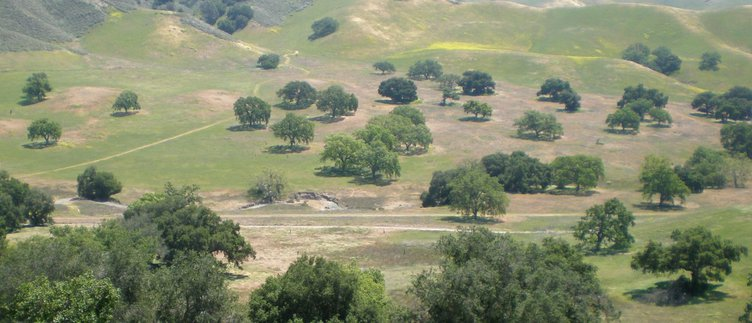

```{r, echo = FALSE}
knitr::opts_chunk$set(collapse = TRUE, comment = "#>", fig.show = "hold")
options(width = 80)
```

Tne `nestedRanksTest` package provides functions for performing a
Mann-Whitney-Wilcoxon-type nonparametric test for a difference between
treatment levels using nested ranks, together with functions for displaying
results of the test.  The nested ranks test may be used when observations are
structured into several groups and each group has received both treatment
levels.  The p-value is determined via bootstrapping.

The `nestedRanksTest` is intended to be one possible mixed-model extension of
the Mann-Whitney-Wilcoxon test, for which treatment is a fixed effect and group
membership is a random effect.  The standard Mann-Whitney-Wilcoxon test is
available in R as [`wilcox.test`][wilcox].

[wilcox]: https://stat.ethz.ch/R-manual/R-patched/library/stats/html/wilcox.test.html

We first described the nested ranks test in detail in the supplemental
information of [Thompson *et al*. (2014)](#Thompson2014).  Here we consider an
example case, the results of which were first presented in that paper.

# Background

Together with my colleagues Pamela Thompson, Peter Smouse and Victoria Sork, we
were examining year-to-year differences in acorn movement by acorn woodpeckers
in an oak savannah in central California.  Drs Sork and Smouse have
collaborated for several years studying patterns of genetic diversity in oak
populations, unraveling the ways in which genetic diversity moves around the
landscape via dispersal of pollen and seeds.  This work usually involves the
development of analytic methods to help study patterns of dispersal.

[Acorn woodpeckers (*Melanerpes formicivorus*)][KoenigMumme] are highly social
and highly territorial, with each woodpecker group [breeding
cooperatively][StaceyKoenig] and maintaining its own granary in which it stores
up to thousands of acorns.  [Granaries][GranaryImageSearch] are constructed by
the woodpeckers; they drill many closely spaced holes into bark or wood which
they fill during times of acorn production.  In our study site, granaries are
nearly always constructed in the thick bark of [valley oak (*Quercus
lobata*)][ValleyOak], while acorns were harvested from both valley oak and
[coast live oak (*Quercus agrifolia*)][LiveOak].  Coast live oaks have
darker-green canopies in the picture below, while live oaks have lighter-green
canopies.



Oaks are [mast-seeding][MastSeeding] species; their acorn production can vary a
great deal from year to year.  One of the questions we asked during our
year-to-year comparisons was: Do woodpeckers forage for acorns farther from
their granaries during years of low acorn production?  This is a common-sense
prediction from [optimal foraging theory][OptimalForagingTheory]: if there is
food available close to home, why travel far?  In years of high acorn
production, acorns tend to be readily available throughout the landscape, but
time and energy are saved by foraging from trees closer to the granary.  When
acorn production is low, more travel is required to find acorns, and
woodpeckers are likely to gather acorns from trees that are on average farther
away from their granaries.

[KoenigMumme]: http://www.amazon.com/gp/product/0691084645/ref=as_li_tl?tag=itsbadnindeof-20
[StaceyKoenig]: http://www.amazon.com/gp/product/0521378907/ref=as_li_tl?tag=itsbadnindeof-20
[GranaryImageSearch]: https://www.google.com/search?q=acorn+woodpecker+granaries&num=100&newwindow=1&hl=en&tbm=isch
[ValleyOak]: http://en.wikipedia.org/wiki/Quercus_lobata
[LiveOak]: http://en.wikipedia.org/wiki/Quercus_agrifolia
[MastSeeding]: http://www.hastingsreserve.org/oakstory/AmerSciMastKoenig_05.pdf
[OptimalForagingTheory]: http://en.wikipedia.org/wiki/Optimal_foraging_theory


# Initial analyses

<a name="InitialAnalyses">First</a>, we prepare our datasets and generate
tables to see what our sample sizes are.

```{r}
library(nestedRanksTest)
data(woodpecker_multiyear)
d.Qlob <- subset(woodpecker_multiyear, Species == "lobata")
d.Qagr <- subset(woodpecker_multiyear, Species == "agrifolia")
table(d.Qlob$Year, d.Qlob$Granary)
table(d.Qagr$Year, d.Qagr$Granary)
```

We create exploratory plots to see if any obvious structure appears.
Relatively few seed movements are longer than 500 m:

```{r}
sum(d.Qlob$Distance > 500)
sum(d.Qagr$Distance > 500)
```

so for clarity we exclude outliers from these plots.  To reduce overplotting
and give us a better sense of acorn numbers at each distance, we also jitter
the y-position of the points just a bit.

```{r, fig.width = 5, fig.height = 5}
opa <- par(mfcol = c(2, 1), cex = 0.8, mar = c(3, 3, 0, 0), las = 1,
           mgp = c(2, 0.5, 0), tcl = -0.3)
stripchart(Distance ~ Granary, data = d.Qlob, subset = Year == "2002",
           xlab = "Distance (m)", ylab = "Granary", pch = 1, col = "blue",
           method = "jitter", jitter = 0.2, xlim = c(0, 500),
           frame.plot = FALSE)
stripchart(Distance ~ Granary, data = d.Qlob, subset = Year == "2004",
           pch = 1, col = "red", method = "jitter", jitter = 0.2, add = TRUE)
legend("bottomright", legend = c("2002", "2004"), pch = 1, bty = "n",
       col = c("blue", "red"), title = "Valley oak acorns")
stripchart(Distance ~ Granary, data = d.Qagr, subset = Year == "2006",
           xlab = "Distance (m)", ylab = "Granary", pch = 1, col = "blue",
           method = "jitter", jitter = 0.2, xlim = c(0, 500),
           frame.plot = FALSE)
stripchart(Distance ~ Granary, data = d.Qagr, subset = Year == "2007",
           pch = 1, col = "red", method = "jitter", jitter = 0.2, add = TRUE)
legend("bottomright", legend = c("2006", "2007"), pch = 1, bty = "n",
       col = c("blue", "red"), title = "Live oak acorns")
par(opa)
```

Seeds moved 0 m (always valley oak) were harvested from the same tree that
hosted the granary.

There do appear to be between-year differences for each oak species, but
clearly there is also a lot of granary-specific structure.  This occurs because
each granary has its own neighbourhood of oak trees at varying distances, and
the territorial acorn woodpeckers are most likely to forage in their specific
neighbourhood and have a neighbourhood-specific collection of seed movement
distances ([Scofield *et al*. 2010](#Scofield2010), [Scofield *et al*.
2011](#Scofield2011), [Thompson *et al*. 2014](#Thompson2014)).  The
`woodpecker_multiyear` dataset does not include seed source tree identities,
but we can treat each unique distance as the identity of a unique tree because
of the relative sparseness of the trees in the landscape.  Calculating the
median distance to seed trees used, we do see a great deal of variation.

```{r}
with(d.Qlob, unlist(lapply(lapply(split(Distance, Granary), unique), median)))
with(d.Qagr, unlist(lapply(lapply(split(Distance, Granary), unique), median)))
```

We discussed the unusually long acorn movement distances of coast live oak for
granary 140 in [Scofield *et al*. (2010)](#Scofield2010).

Because of the variation in distances, a nonparametric test such as the
Mann-Whitney-Wilcoxon test ([`wilcox.test`][wilcox]) is preferred to a parametric test
such as `t.test`.

```{r}
wilcox.test(Distance ~ Year, data = d.Qlob)
wilcox.test(Distance ~ Year, data = d.Qagr)
```

The results reveals significant differences for live oak but not valley oak.
However, this approach is unsatisfying because it ignores spatial structure we
can see in the data.  One possibility might be to test for year-to-year
differences for each granary individually.  For brevity we examine just the
p-values for each test:

```{r}
wilcox.p.value <- function(x) wilcox.test(Distance ~ Year, data = x, exact = FALSE)$p.value
round(unlist(lapply(split(d.Qlob, d.Qlob$Granary), wilcox.p.value)), 4)
round(unlist(lapply(split(d.Qagr, d.Qagr$Granary), wilcox.p.value)), 4)
```

This solution is still not satisfying.  The [sample sizes](#InitialAnalyses)
are too small for convincing single-granary results, there is clearly some
issue with assumptions of `wilcox.test` (note the `NaN` values for some
p-values), and the answers do not fit the scale of our original question:  are
there *overall* differences in seed movement between high- and low-crop years?
We could find or develop a technique to combine the p-values, but this is still
off the mark.

A better test would allow for differences between granaries, while testing for
the aggregate between-year difference in acorn movement distances about which
we are curious.  In model terms, a better test would evaluate all data together
while treating year as a fixed effect and granary as a random effect, akin to a
[mixed model][MixedModel].  This was our motivation for developing
`nestedRanksTest`.

[MixedModel]: http://en.wikipedia.org/wiki/Mixed_model

# Using the test

The `nestedRanksTest` takes three variables:

* Continuous response, named `y`
* Treatment factor with exactly two levels, named `x`, this will be coerced to a factor if it is not already
* Grouping factor, named `groups`, this too will be coerced to a factor

There are two interfaces for the test:

* a formula interface, the simplest to use, takes a formula of the form `y ~ x | groups` and includes `data` and `subset` arguments
* a default interface, that accepts `x`, `y` and `groups` as separate arguments

The grouping factor may be provided using the `groups =` argument in either the
formula or default interfaces.  This argument can be used when the formula has
the form `y ~ x`.  All of the following are valid and produce identical results.

```{r, eval = FALSE}
result <- nestedRanksTest(Distance ~ Year | Granary, data = d.Qlob)
result <- nestedRanksTest(Distance ~ Year, groups = Granary, data = d.Qlob)
## Because no data= for default interface, here we use with()
result <- with(d.Qlob, nestedRanksTest(Year, Distance, Granary))
result <- with(d.Qlob, nestedRanksTest(y = Distance, x = Year, groups = Granary))
```

The grouping factor is required, and it is an error to provide a grouping
factor twice using both the formula and the argument.

```{r, eval = FALSE}
## Error: 'groups' missing
result <- with(d.Qlob, nestedRanksTest(Year, Distance))
## Error: invalid group specification in formula (no "| grouping.variable")
result <- nestedRanksTest(Distance ~ Year, data = d.Qlob)
## Error: groups are specified with '|' in formula or with groups= argument, but not both
result <- nestedRanksTest(Distance ~ Year | Granary, groups = Granary, data = d.Qlob)
```

# Examining results

The return value of `nestedRanksTest` is a list of class `'htest_boot'`, a class which extends the often-used class `'htest'`.  `print` and `plot` methods are provided.

```{r}
result.Qlob <- nestedRanksTest(Distance ~ Year | Granary, data = d.Qlob, n.iter = 2000)
print(result.Qlob)
#
#
result.Qagr <- nestedRanksTest(Distance ~ Year | Granary, data = d.Qagr, n.iter = 2000)
print(result.Qagr)
```

We can also plot the results.

```{r, fig.width = 6, fig.height = 3}
plot(result.Qlob)
```

Titles, colours, line styles, etc. may be modified.

```{r, fig.width = 6, fig.height = 3}
plot(result.Qagr, main = expression(italic("Quercus agrifolia")), col = "lightgreen",
     p.col = "brown4", p.lty = 1, p.lwd = 4, mgp = c(2.5, 0.5, 0), las = 1, tcl = -0.4)
```


# Return value

The return value of `nestedRanksTest` is a list of class `'htest_boot'`, which
extends the often-used class `'htest'` by including some members that allow for
further description of the bootstrap process and null distribution.  Components
marked with `"*"` are additions to `'htest'`.


| Component            |  Contents |
| -------------------- | --------- |
| `statistic`          | the value of the observed Z-score. |
| `p.value`            | the p-value for the test. |
| `alternative`        | a character string describing the alternative hypothesis. |
| `method`             | a character string indicating the nested ranks test performed. |
| `data.name`          | a character string giving the name(s) of the data.. |
| `bad.obs`            | the number of observations in the data excluded because of `NA` values. |
| `null.values`        | quantiles of the null distribution used for calculating the p-value. |
| `n.iter*`            | the number of bootstrap iterations used for generating the null distribution. |
| `weights*`           | the weights for groups, calculated by `nestedRanksTest_weights`. |
| `null.distribution*` | vector containing null distribution of Z-scores, with `statistic` the last value. |

The length of `null.distribution` equals `n.iter`.  Note that
`null.distribution` will not be present if the `lightweight = TRUE` option was
given to `nestedRanksTest`.

The structure of the class is:

```{r}
str(result.Qlob)
```

# Details

In brief, group-specific between-treatment Z-scores are calculated, a bootstrap
distribution of Z-scores is calculated for each group by using the same procedure
but with ranks shuffled without regard to treatment, then the observed and
bootstrapped Z-scores are aggregated by weighting each group's contribution by
sample size.

## Z-statistic

Values across both treatments are ranked using the base R function `rank` with
`ties.method = "average"`, which assigns tied values their average rank.  The
Mann-Whitney-Wilcoxon test statistic is computed from these ranks.  The value 
of this statistic is sample-size dependent, between
-*n*<sub>1</sub>&times;*n*<sub>2</sub> and
*n*<sub>1</sub>&times;*n*<sub>2</sub>, where *n*<sub>1</sub> and
*n*<sub>2</sub> are group-specific sample sizes for each treatment level.  The
statistic is scaled to [-1, +1] by dividing by
*n*<sub>1</sub>&times;*n*<sub>2</sub>.

Help for the function performing this calculation is available via
`?nestedRanksTest_Z` and its code can be examined directly with:

```{r, eval = FALSE}
nestedRanksTest::nestedRanksTest_Z
```

## Bootstrap procedure

The bootstrap procedure is performed for each group separately.  For each
bootstrap iteration, response values are shuffled without regard to treatment
using the base R function `sample` with `replace = FALSE`.  The Z-statistic is
calculated using the above procedure while maintaining the same *n*<sub>1</sub>
and *n*<sub>2</sub> values.  This is repeated `n.iter - 1` times for each
group, and the bootstrapped Z-statistics are placed in a vector with the
observed Z-statistic as the `n.iter`-th value.  The vectors for each group are
collected into the columns of a matrix.

## Group weights

Weights are calculated for each group by multiplying the treatment-specific
sample sizes for each group (*n*<sub>1</sub>&times;*n*<sub>2</sub>), and then
dividing each by the sum of *n*<sub>1</sub>&times;*n*<sub>2</sub> for all
groups.  Thus the weights sum to 1.

Help for the function performing this calculation is available via
`?nestedRanksTest_weights` and its code can be examined directly with:

```{r, eval = FALSE}
nestedRanksTest::nestedRanksTest_weights
```

The return value is a `data.frame` with group-specific information including
weights and sample sizes in each treatment.

## Aggregate Z-score and p-value

The aggregate Z-core for the observed data and each bootstrap iteration by
multiplying each row of the matrix described in the bootstrap procedure by the
weights, and then summing the values in each row, resulting in a vector of
aggregate Z-scores of length `n.iter` with the Z-score for the observed data as
the `n.iter`-th value.  This vector is returned in the `null.distribution`
element of class `'htest_boot'`, but is not returned if the `lightweight =
TRUE` option was used when invoking `nestedRanksTest`.

The p-value is calculated by counting the number of elements in the vector
greater than or equal to the Z-score for the observed data.  Because the
observed Z-score is an element of this vector, the p-value can never be less
than 1 / `n.iter`.

* * *

These statistical tools were developed in collaboration with Peter E. Smouse
(Rutgers University) and Victoria L. Sork (UCLA) and were funded by U.S.
National Science Foundation awards NSF-DEB-0514956 and NSF-DEB-0516529.

* * *


# References

Details are also available in Appendix A of the the supplemental information
for [Thompson *et al*. (2014)](#Thompson2014), while the code in this package
is updated and expanded from that in Appendix B of the same supplemental
information.

[Scofield2010]: http://dx.doi.org/10.1111/j.1365-2745.2010.01649.x
[Scofield2011]: http://dx.doi.org/10.1007/s00442-010-1828-5
[Thompson2014]: http://www.movementecologyjournal.com/content/2/1/12

<a name="Scofield2010">Scofield, D. G., Sork, V. L., and Smouse, P. E.</a>  (2010)  Influence of acorn woodpecker social behaviour on transport of coast live oak (*Quercus agrifolia*) acorns in a southern California oak savanna.  [*Journal of Ecology* **98**: 561-572][Scofield2010].

<a name="Scofield2011">Scofield, D. G., Alvaro, V. R., Sork, V. L., Grivet, D., Martinez, E., Pluess, A., Koenig, W. D. and Smouse, P. E.</a>  (2011)  Foraging patterns of acorn woodpeckers (*Melanerpes formicivorus*) on valley oak (*Quercus lobata* N&eacute;e) in two California oak savannah-woodlands.  [*Oecologia* **168**: 187-196][Scofield2011].

<a name="Thompson2014">Thompson, P. G., Smouse, P. E., Scofield, D. G., and Sork, V. L.</a> (2014)  What seeds tell us about birds: a multi-year analysis of acorn woodpecker foraging movements.  [*Movement Ecology* **2**: 12][Thompson2014].
